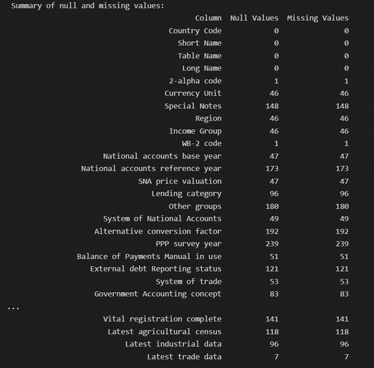
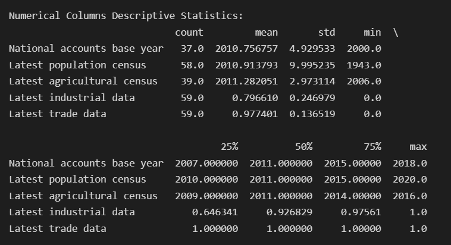

# 🌍 ESG Country Analysis — Data-Driven Insights for Global Sustainability

This project dives into country-level ESG (Environmental, Social, Governance) indicators and transforms a complex, inconsistent dataset into a clean, normalized, and insight-rich resource. The project empowers sustainability-focused decision-making across regions and income groups through advanced data cleaning, exploratory analysis, and predictive modeling.

🔍 Designed for analysts, researchers, and policymakers seeking to understand global ESG dynamics — and built to demonstrate strong capabilities in data wrangling, EDA, statistical modeling, Power BI, and storytelling — essential for a data analyst role.

---

## 📌 Project Overview

- **Objective**: Clean, standardize, and analyze ESG metrics across 200+ countries, identifying key sustainability and economic trends.
- **Scope**: From raw CSV to policy-ready insights — includes null analysis, Min-Max normalization, descriptive analytics, Power BI visualizations, and time-series forecasting.

---

## 📁 Dataset Summary

- **Source**: [Kaggle - ESG Dataset by Tunguz](https://www.kaggle.com/datasets/tunguz/environment-social-and-governance-data)
- **File**: `ESGCountry.csv`
- **Rows (initial)**: 239 countries
- **Final Sample**: 59 complete country profiles
- **Columns Retained**: 23 ESG-focused features (population, trade, industry, governance, etc.)

---

## 🧹 Data Cleaning & Normalization

- Dropped columns with >50% missing values and those unrelated to ESG (e.g., financial logs, redundant metadata)
- Renamed `"Table Name"` ➝ `"Country"` for clarity
- Dropped rows with incomplete data to maintain data integrity
- Imputed where feasible using mean/mode
- Normalized numeric fields (trade & industry data) using **Min-Max scaling**
- Final dataset shape: `59 rows × 23 columns`

---

## 📈 Descriptive Analytics

Key questions explored:
- What is the distribution of income groups across regions?
- Is there a relationship between population size and trade activity?
- Which regions show the highest recent industrial output?

---

## 📊 Highlighted Visuals & Analysis

### 📌 Missing Value Summary
🧼 Snapshot of null distribution across features before cleaning  


### 📌 Descriptive Statistics (Before Normalization)
📉 Stats summary of core ESG metrics  


### 📌 Power BI Visualizations
📊 ESG indicator exploration including income group distribution, industrial trends, and trade metrics  
📁 [View Power BI Visualizations](./visuals/esg_country_visualizations.pbix)

> All visual assets and stats were generated through Python and Power BI to support reproducibility and transparency.

---

## 🔮 Predictive Analytics

Applied **time-series forecasting** using `National accounts base year` as temporal proxy:

1. **Forecast: Latest Trade Data**  
   - Peak seen around 2008  
   - Stabilization predicted post-2018 with wide confidence intervals  
   - Suggests vulnerability to external shocks (e.g., geopolitics)

2. **Forecast: Population Growth**  
   - Historic spike near 2008  
   - Forecast predicts a stable population near 4K units  
   - Uncertainty highlights regional divergence in population dynamics

---

## 🧠 Key Takeaways

- Industrial strength varies significantly by region (e.g., South Asia lags)
- Population size is positively linked to trade potential
- Modernized trade reporting is growing across many countries
- Predictive analytics suggest future stability, but regional/geopolitical risk persists

> 📌 This project reflects real-world data analyst skills — from raw data to clean, visualized, and forecasted insights — and demonstrates my ability to work with Python, BI tools, and storytelling for decision-making.

---

## 🗂️ Project Structure

## 📁 Project Structure

```
esg-country-analysis/
│
├── README.md
│   # This file
│
├── data/
│   ├── ESGCountry.csv
│   └── cleaned_normalized_ESGCountry.csv
│   # Raw and cleaned ESG datasets
│
├── scripts/
│   └── esg_cleaning_script.py
│   # Python script used for data cleaning, preprocessing, and descriptive stats
│
├── visuals/
│   ├── null_summary.png
│   ├── descriptive_stats.png
│   └── esg_country_visualizations.pbix
│   # Null & stats snapshots, Power BI file with ESG visualizations
│
├── docs/
│   └── Final_Project_Paper_Abhijit.pdf
│   # Final project report with insights and interpretations
```
